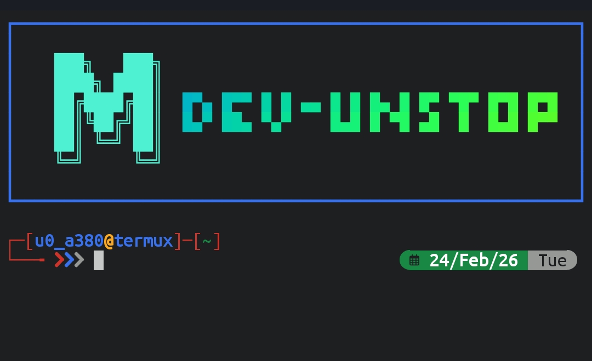

---

# Premium Terminal Branding for Termux

---

Transform your Termux shell into a personalized, aesthetic command center with **Termux** — a modular setup featuring custom headers, ZSH themes, logo art, and interactive menus.
## 🚀 Features

- 🎨 **Custom Logo & Title**: Display ASCII art logos and figlet-rendered titles with color gradients.
- 🧠 **Smart ZSH Setup**: Oh-My-Zsh integration with plugin manager and theme selector.
- 🧩 **Interactive Menus**: Powered by `fzf` and `gum` for intuitive selection.
- 🛠️ **One-Tap Setup**: Install all dependencies and configure your shell in minutes.
- 🧾 **Aliases & Enhancements**: Modern replacements for `ls`, `cat`, and more using `eza`, `bat`, `logo-ls`.

## Preview of after setup completed..


---

## 📦 Requirements

Make sure the following packages are installed:

```bash
pkg install curl fd figlet ruby boxes gum bat logo-ls eza zsh timg fzf
gem install lolcat
```

## 🧑‍💻 Installation

1. `pkg update -y && pkg upgrade -y && pkg install git fzf -y`
2. `git clone https://github.com/circle-earth/Termux.git`
3. `cd Termux/`
4. `ls`
5. `bash install.sh`
6. after complete all processing just --open new session-- or `source ~/.zshrc`

This script will:

- Install required packages
- Set up ZSH and Oh-My-Zsh
- Apply custom fonts and themes
- Configure `.zshrc`, `.profile`, and `.aliases`

## 🛠️ Troubleshooting

**Termux Force Close Issue**  
If you're experiencing Termux force closing after installing T-Header:

> 🔧 **Fix**:  
Navigate to the project root directory and run:
```bash
git pull
bash install.sh
```
This will update the files and re-run the setup to resolve any compatibility issues.

## 🧭 Usage

After installation, use the following commands:

| Command     | Description                  |
|------------|------------------------------|
| `theader`  | Launch interactive setup     |
| `clogo`    | Change logo                  |
| `ctitle`   | Set custom header title      |
| `ctpro`    | Switch `termux.properties`   |
| `cztheme`  | Change ZSH theme             |
| `ac`			 | Smart Auto-Commit Tool				|
| `cak`			 | API Key Manager						  |

## 🖼️ Preview

```bash
figlet -f pixelfont "Unstop" | lolcat
```

 <!-- Replace with actual screenshot if available -->

## 🧙‍♂️ Customization

- Logos stored in `~/.config/theader/logo`
- Themes in `~/.oh-my-zsh/custom/themes`
- Config file: `~/.config/theader/theader.cfg`

You can edit these manually or use the interactive menu.

### Widgets (ZSH)
- `Alt+T`: Insert file path
- `Alt+C`: Change directory
- `Ctrl+R`: Search history

## 🧼 Uninstall

```bash
rm -rf ~/.config/theader ~/.oh-my-zsh ~/.zshrc ~/.profile ~/.aliases
```

## 📜 License

[](LICENSE)

---

## Termux Wiki

[](https://github.com/circle-earth/Termux/wiki)

---
## 🙏 Acknowledgements

This project is based on **T-Header** by **[@remo7777](https://github.com/remo7777)**.  
All core ideas, structure, and the original terminal branding system belong to the original author.

- 🔗 **Original Repository:**[T-Header](https://github.com/remo7777/T-Header)  

Huge thanks to **remo7777** for building and open-sourcing this awesome Termux customization toolkit. 💙